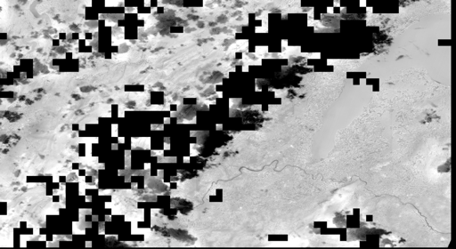

# sentinel-fusion

Fusing data from the ESA Copernicus Programme's Sentinel missions.

This repository implements code to increase the resolution of the Land Surface Temperature (LST) band of Sentinel-3 (1km pixel size) by exploiting the higher resolution visible spectrum bands of Sentinel-2 (10-60m pixel size).

[](https://zenodo.org/badge/latestdoi/289903198)

## 1. Setup

*Warning*: these instructions have been tested on a macOS Catalina Version 10.15.6. You might have to adapt the steps below according to your system.

To be able to run the programs locally, first download or clone this repository to your local system, placing it at a location that I will refer to as `<repository_dir>`. Then, follow the steps below.

### 1. Create a conda environment

Open a Terminal window, navigate to `<repository_dir>`, and run

```sh
conda create --name sentinel-fusion python=3.6
```

to create the environment `sentinel-fusion` (you can also use any other name that you like). Then, remember to activate the environment, *i.e.*,

```sh
conda activate sentinel-fusion
```

every time you want to call a program from the repository.

### 3. Install gdal

Within the `sentinel-fusion` environment, run

```
conda install -c conda-forge gdal==3.0.4
```

This step is done separately from the installation of other packages because it is important to install this specific version of gdal (and install it with `conda`) to avoid conflicts with the SNAP installation.

### 2. Install SNAP

(The steps below were tested with SNAP versions 7.0 and 8.0)

Go to the the [SNAP download page][snap-download] and download and install the Sentinel Toolboxes on your system. You have to setup the `snappy` Python module for use within the `sentinel-fusion` conda environment. It might be possible to setup `snappy` for your system at the end of the Sentinel Toolboxes installation, but for macOS Catalina I had to resort to the instructions I have detailed in [snappy_config_catalina.md](snappy_config_catalina.md). You also have to make sure that you can call the SNAP Graph Processing Tool (GPT) command line interface. To check that this is the case, open the Terminal, run

```sh
gpt -h
```

and observe if the output starts with 

```
Usage:
  gpt <op>|<graph-file> [options] [<source-file-1> <source-file-2> ...]

Description:
  This tool is used to execute SNAP raster data operators in batch-mode. The operators can be used stand-alone or combined as a directed acyclic graph (DAG). Processing graphs are represented using XML. More info about processing graphs, the operator API, and the graph XML format can be found in the SNAP documentation.
```

### 3. Install pyDMS

Download or clone [pyDMS][pydms], a Python Data Mining Sharpener implementation, into a location `<pyDMS_dir>` in your local system. To install it, open a Terminal window, navigate to `<pyDMS_dir>`, make sure that you are within the `sentinel-fusion` environment, and run

```sh
python setup.py install
```

### 4. Install the remaining dependencies

Run 

```sh
pip install -r requirements.txt
```

## 2. Data download

The Python script `sentinel_data_download.py` coordinates the download of Sentinel-2 and Sentinel-3 products. Type 

```sh
python download_sentinel_data.py --help
```

on the Terminal for usage information. You can also simply open the Terminal and run 

```sh
sh download_sentinel_data.sh
```

to download a default dataset. After running `sentinel_data_download.py`, you should have `.SAFE` folders in `data/Sentinel-2` and `.SEN3` folders in `data/Sentinel-3`. These folders are called, respectively, Sentinel-2 and Sentinel-3 products.

*Optional:* If you want to run the validation scripts to compare the sharpening result to Landsat thermal infrared (TIR) imagery, you should go to [https://earthexplorer.usgs.gov/](https://earthexplorer.usgs.gov/) and order a Bulk Download of the scene with ID `LC08_L1TP_196028_20200818_20200823_01_T1`. The downloaded folder should then be placed under `data/Landsat`.

## 3. Pre-processing

Open the Terminal and run

```sh
sh write_dim_products.sh
```

to save the default Sentinel products as BEAM-DIMAP files. These files are needed for the pre-processing programs. Then, run

```sh
sh pre_process_sentinel.sh
```

to pre-process the default Sentinel products. In doing so, you will create the set of BEAM-DIMAP files that the LST sharpening procedure needs.

If you want to use data other than the default, check the contents of the scripts [write_dim_products.sh](write_dim_products.sh) and  [pre_process_sentinel.sh](pre_process_sentinel.sh) to see what commands you need to issue. Essentially, you can simply make copies of these two scripts and change the names of the Sentinel products that the copies point to.

Please note that the pre-processing step may take a while.

You can view the processed BEAM_DIMAP products afterwards on SNAP. For Sentinel-2, you will have reflectance and elevation products, whereas for Sentinel-3 you will have LST and quality mask products . Considering the default Sentinel download, the reflectance product yields an RBG view that looks like this:


The elevation product is the output of an [SRTM 1Sec HGT](https://en.wikipedia.org/wiki/Shuttle_Radar_Topography_Mission) digital elevation model, whose view looks like this:


The processed low-resolution LST product should look like this:


Finally, the quality mask product contains a boolean map indicating which pixels have good quality temperature measurements and which don't. Its view looks like this (white pixels are good):


*Optional:* If you want to run the validation scripts to compare the sharpening result to Landsat thermal infrared (TIR) imagery, you should also run

```
sh pre_process_landsat.sh
```

The processed `BEAM-DIMAP` product will then be available under `data/Landsat/LC08_L1TP_196028_20200818_20200823_01_T1`. It contains a band of estimated **LST** values for the Landsat scene, whose view should look like this:


## 4. LST sharpening

After the pre-processing is done, you can run 

```sh
sh sharpen.sh
```

on the Terminal to get a sharpened LST using the default Sentinel products. The sharpened LST will be saved as a BEAM-DIMAP file that you can browse on SNAP. The view of LST band of the sharpened, default Sentinel-3 product looks like this:


(The black pixels represent locations with unreliable surface temperature measurements in the original, low-resolution LST map). 

Check the scripts [data_mining_sharpener.sh](data_mining_sharpener.sh) and [sharpen.sh](sharpen.sh) for inspiration on how you can adapt the program's arguments for your own purposes.

## 5. (Optional) Validation with Lansat data

If you pre-processed the Landsat data before, you may now run

```
sh evaluate_sharpening.sh
```

to see how well the LST sharpening in the previous step fares against a baseline nearest-neighbor upsampling of the original low-resolution LST map. The idea in this evaluation script is to interpret the estimated LST values from a Landsat 8 TIR Level-1 product (available at 30m resolution) as the ground truth target for the LST sharpening procedure. 

The evaluation script outputs RMSE, median bias, and standard deviation of bias for the residual (difference) between the the Landsat ground-truth and the baseline and sharpened maps. It also saves the residual maps as `BEAM-DIMAP` products on the Sentinel-3 folder, so that you can examine the differences on a pixel-by-pixel basis. For the default Sentinel data, the evaluation report outputs

```
Baseline nearest neighbor upsampling:
	RMSE: 9.00
	Median bias: -4.67
	Standard deviation of bias: 7.29

Sharpening:
	RMSE: 8.70
	Median bias: -4.64
	Standard deviation of bias: 6.50
```

 The baseline residual looks like this:


and the sharpened LST residual looks like this:



## Acknowledgements

This work was done in the context of a project with [GRID-Geneva][grid-geneva].

Some of the scripts in this repository are based on the ones in https://github.com/DHI-GRAS/sen-et-snap-scripts/, produced by the [Sen-ET project][sen-et-webpage] team.

## License

The content is released under the terms of the [GNU General Public License](LICENSE).


[sen-et-webpage]: http://esa-sen4et.org/
[grid-geneva]: https://unepgrid.ch/en
[pydms]: https://github.com/radosuav/pyDMS
